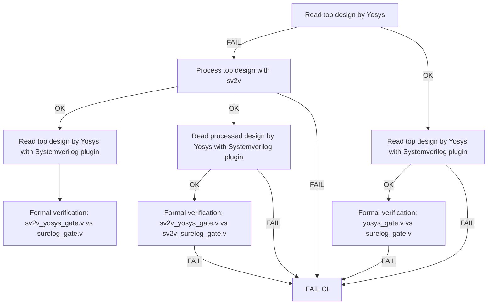

# Formal verification basics

Flow graph for [formal_verification.py](../formal_verification.py) is presented on a diagram below. All end nodes that are not connected to `FAIL CI` node, will keep CI green but results in logs might still contain some errors for non-required checks.


A table below presents example for [formal/formal_results.py](formal_results.py) script generated on all test from [UHDM-integration-tests](https://github.com/chipsalliance/UHDM-integration-tests). It is generated in markdown style which is parsed in CI summary:
```
# Synthesis results
| Result   | Yosys | sv2v + Yosys |                   Description                    |
|----------|-------|--------------|--------------------------------------------------|
|     FAIL |   151 |           16 | Error in Yosys, possibly error in model          |
|  SKIPPED |     0 |          110 | Test was not run due to previous pass/error      |
|SV2V_FAIL |     0 |            7 | sv2v failed to convert test case                 |
|       OK |   110 |          128 | Successful synthesis without formal verification |
# Formal verification results
|   Result    | SV plugin | sv2v + SV plugin |                      Description                       |
|-------------|-----------|------------------|--------------------------------------------------------|
|        PASS |       181 |               94 | Formally equivalent                                    |
|        DIFF |        22 |                8 | Formally not-equivalent                                |
|     NO GATE |         0 |                0 | Both parsers didn't produce gate-level netlist         |
|      S GATE |         0 |                0 | Surelog parser didn't produce gate-level netlist       |
|      Y GATE |         2 |                1 | Yosys parser didn't produce gate-level netlist         |
|INCONCLUSIVE |         0 |                0 | Inconclusive                                           |
|       INCOM |         0 |                0 | Incomplete, missing module declaration => Inconclusive |
|     UH PLUG |         0 |                0 | UHDM Plugin error                                      |
|    UH YGATE |         0 |                0 | UHDM Plugin error + Yosys no gate                      |
|    MODEL_ER |        20 |                4 | Error in model                                         |
|    MODEL EM |        11 |                4 | Model is empty                                         |
|        FAIL |         2 |               17 | Error in Yosys, possibly error in model                |
|     SKIPPED |        23 |              133 | Test was not run due to previous pass or Yosys fail    |
```
