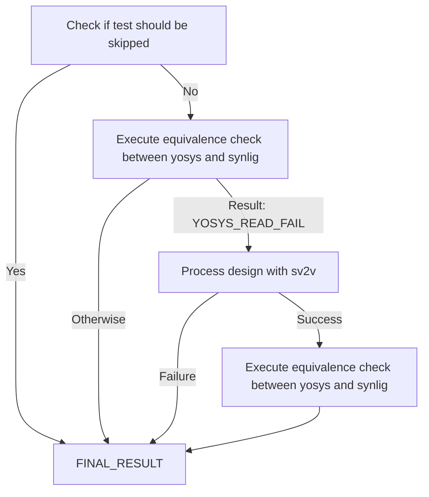

# Formal verification basics

Flow graph for [run.py](run.py) is presented on a diagram below.

Possible final results from equivalence check:
 * `PASS` - designs are formally equivalent,
 * `FAIL` - designs are formally not equivalent,
 * `SKIP` - test was skipped,
 * `READ_FAIL` - either `yosys` or `synlig` couldn't read design,
 * `EMPTY_MODULE` - synlig or yosys produced empty module,
 * `UNMATCHED_MODULE` - different module names or count is produced,
 * `NOTHING_TO_COMPARE` - couldn't find any pair of corresponding cells to compare in designs.
 
A table below presents example for [results.py](results.py) script generated on all simple tests. It is generated in markdown style which is parsed in CI summary:

```
# Formal verification results
|      Result       | Count |                 Description                  |
|-------------------|-------|----------------------------------------------|
|              PASS | 276   | formally equivalent                          |
|              FAIL | 23    | formally not equivalent                      |
|              SKIP | 4     | not executed                                 |
|   YOSYS_READ_FAIL | 58    | yosys couldn't read design                   |
|  SYNLIG_READ_FAIL | 4     | synlig couldn't read design                  |
|      EMPTY_MODULE | 5     | synlig or yosys produced empty module        |
|  UNMATCHED_MODULE | 13    | different module names or count was produced |
|NOTHING_TO_COMPARE | 6     | there is nothing to compare in designs       |
|           TIMEOUT | 0     | test timed out                               |
```

It exits with non-zero exit code when at least one of the results is different than expected.
